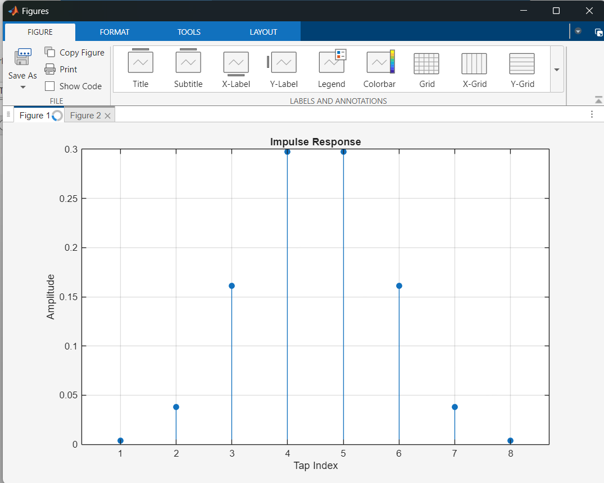
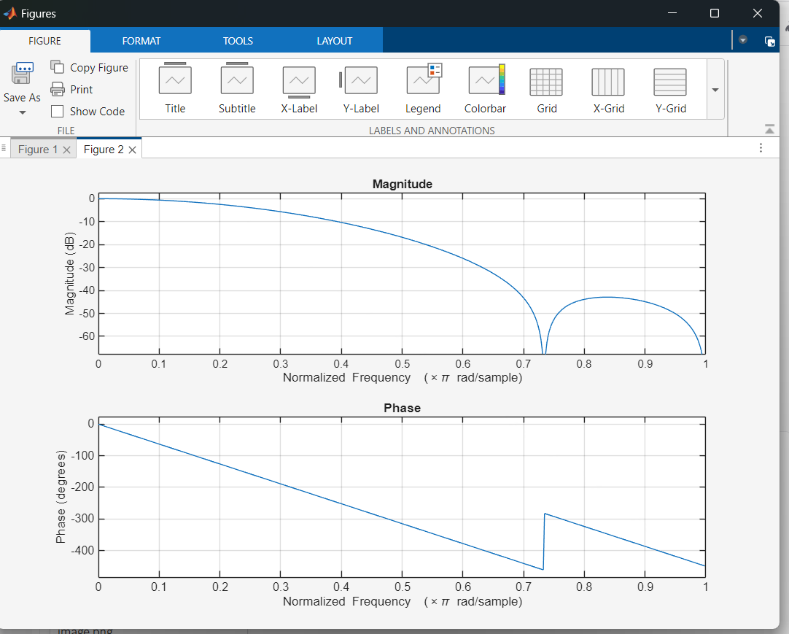
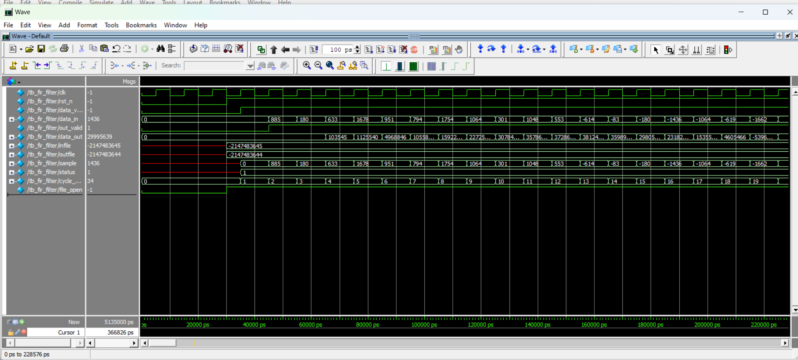
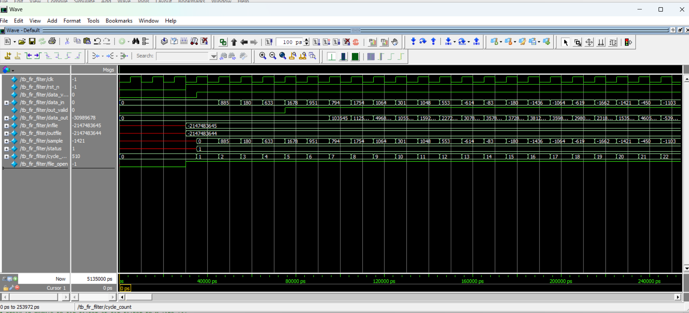
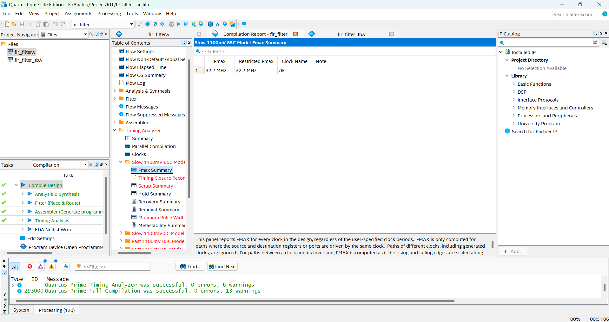
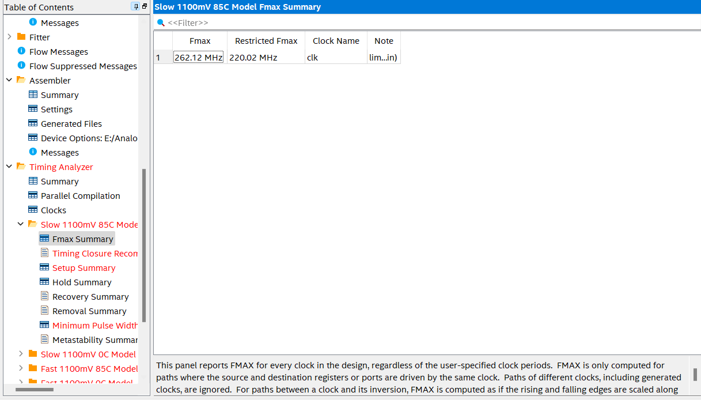

# 8-Tap FIR Filter RTL Design & Verification

An 8-tap low-pass FIR filter implemented in Verilog and verified against a MATLAB golden reference model.

---

## Highlights

- Designed an 8-tap FIR filter using Verilog RTL.
- Implemented two architectures:
  - V1: Combinational MAC
  - V2: 4-Stage Pipelined MAC
- Generated Q1.15 coefficients in MATLAB.
- Verified RTL outputs against MATLAB reference results.
- Improved maximum operating frequency from **33.08 MHz** to **262.12 MHz** (~7.9× speedup).
- Synthesized using Intel Quartus Prime targeting Cyclone V FPGA.

---

## Specifications

| Item | Value |
|--------|--------|
| Filter Type | Low-Pass FIR |
| Number of Taps | 8 |
| Architecture | Direct Form |
| Input Width | 16-bit |
| Output Width | 32-bit |
| Coefficient Format | Q1.15 Fixed-Point |
| Sample Rate | 48 kHz |
| Cutoff Frequency | 6 kHz |

---

## Design Evolution

| Version | Architecture | Fmax |
|----------|----------|----------|
| V1 | Combinational MAC | 33.08 MHz |
| V2 | 4-Stage Pipelined MAC | 262.12 MHz |

**Performance Improvement**

\[
Speedup = \frac{262.12}{33.08} \approx 7.9\times
\]

Pipeline registers reduce the critical path while maintaining a throughput of one output sample per clock cycle.

---

## Verification Flow

```text
MATLAB
   │
   ├── coefficients.txt
   ├── input_samples.txt
   ├── expected_output.txt
   │
   ▼
Verilog RTL
   │
   ▼
ModelSim Simulation
   │
   ├── sim_output_comb.txt
   └── sim_output_pipelined.txt
   │
   ▼
Output Comparison
   │
   ▼
PASS
```

---

## Project Structure

```text
8-tap-FIR-Filter-RTL-Design-Project/
│
├── README.md
│
├── rtl/
│   ├── v1_combinational/
│   │   └── fir_filter.v
│   │
│   └── v2_pipelined/
│       └── fir_filter.v
│
├── tb/
│   └── fir_filter_tb.v
│
├── matlab/
│   └── fir_design.m
│
├── test_vectors/
│   ├── coefficients.txt
│   ├── input_samples.txt
│   └── expected_output.txt
│
├── sim_results/
│   ├── v1/
│   │   ├── expected_output.txt
│   │   └── sim_output_comb.txt
│   │
│   └── v2/
│       ├── expected_output.txt
│       └── sim_output_pipelined.txt
│
└── images/
    ├── matlab_impulse_response.png
    ├── matlab_freq_response.png
    ├── waveformv1.png
    ├── waveformpipelined.png
    ├── timing1.png
    └── timing2.png
```

---

## MATLAB Results

### Impulse Response



### Frequency Response



---

## Simulation Results

### V1 – Combinational FIR



### V2 – Pipelined FIR



Both architectures produce identical output values after latency alignment.

---

## Timing Analysis

### V1 Timing Report



### V2 Timing Report



| Version | Fmax |
|----------|----------|
| V1 | 33.08 MHz |
| V2 | 262.12 MHz |

---

## How to Run

### Compile & Simulate

Since this project contains two different architectures for the FIR filter, you need to use macro definitions (`+define+`) to select which version to compile and simulate.

**Option 1: Combinational Version (No Pipeline)**
```bash
# Compile
vlog +define+DUT_COMB fir_filter_comb.v fir_filter_tb.v

# Simulate
vsim work.tb_fir_filter
run -all

# Important: If you are currently running a simulation, quit it first
quit -sim

# Compile
vlog +define+DUT_PIPELINED fir_filter_pipelined.v fir_filter_tb.v

# Simulate
vsim work.tb_fir_filter
run -all
## Tools

- Verilog HDL
- MATLAB
- ModelSim
- Intel Quartus Prime

---

## Key Learnings

- FIR filter implementation using fixed-point arithmetic.
- Q1.15 coefficient quantization.
- RTL verification using MATLAB golden reference.
- Timing optimization through pipelining.
- FPGA timing analysis and critical path reduction.
- Throughput-latency tradeoff in digital signal processing hardware.

---

## Author

**Phan Duy Khanh**

Electronics & Telecommunications Engineering  
University of Science - VNUHCM
